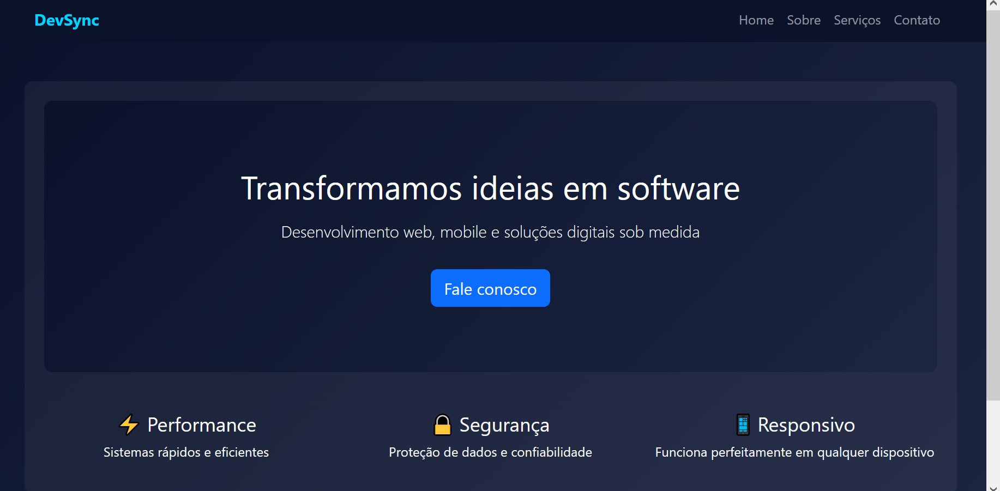
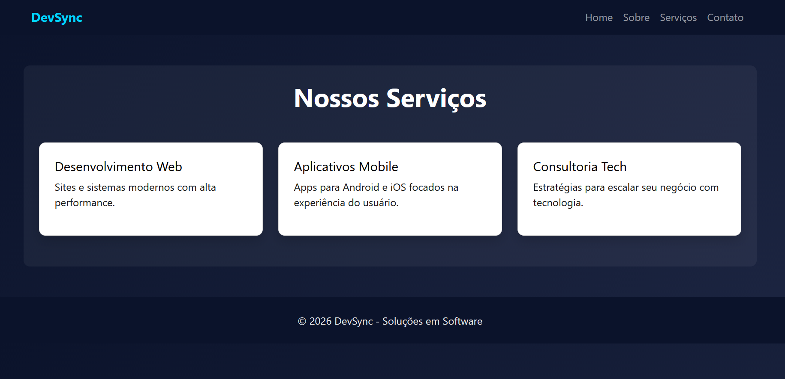
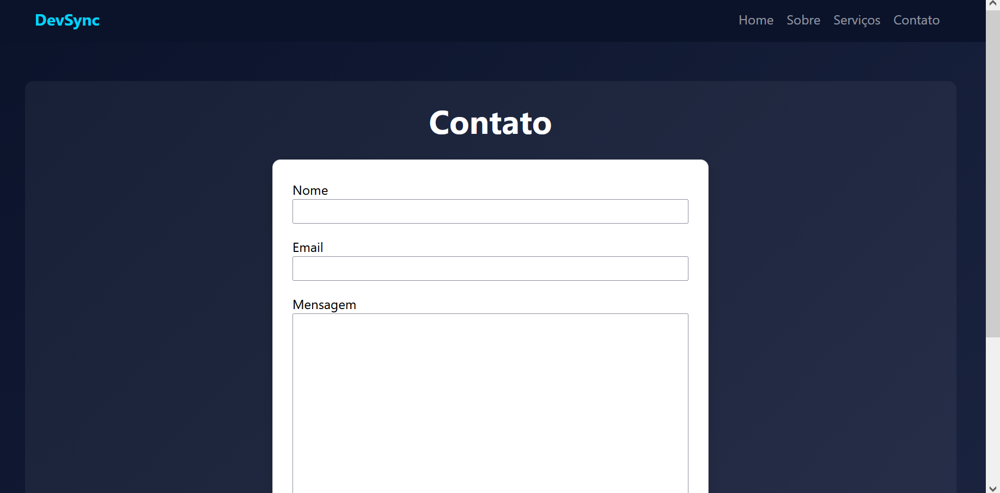
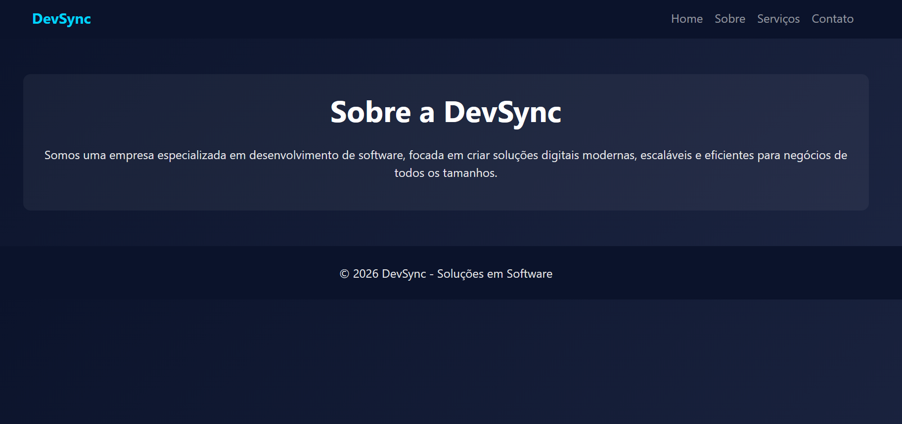

# DevSync - Site Institucional

Projeto desenvolvido como parte de um desafio técnico para criação de um site institucional com formulário funcional.

---

## 📌 Descrição

O **DevSync** é um site institucional fictício para uma empresa de tecnologia focada em desenvolvimento de software.

O projeto possui as seguintes páginas:

* Home
* Sobre
* Serviços
* Contato

A página de contato conta com um formulário funcional que permite o envio de mensagens, armazenando os dados em um banco de dados utilizando Django.

---

## 🖼️ Preview do Projeto

### 🏠 Home



### 🧾 Serviços



### 📬 Contato



### ℹ️ Sobre



---

## 🚀 Tecnologias utilizadas

* Python
* Django
* HTML
* CSS
* Bootstrap

---

## ⚙️ Como executar o projeto

### 1. Clone o repositório

```bash
git clone https://github.com/Arthur-Pereira-Carvalho/site-institucional-django.git
```

---

### 2. Acesse a pasta do projeto

```bash
cd site-institucional-django
```

---

### 3. Crie um ambiente virtual

```bash
python -m venv venv
```

---

### 4. Ative o ambiente virtual

* Windows:

```bash
venv\Scripts\activate
```

* Linux/Mac:

```bash
source venv/bin/activate
```

---

### 5. Instale as dependências

```bash
pip install django
```

---

### 6. Execute as migrações

```bash
python manage.py migrate
```

---

### 7. Inicie o servidor

```bash
python manage.py runserver
```

---

### 8. Acesse no navegador

```
http://127.0.0.1:8000/
```

---

## 📬 Funcionalidade de Contato

O formulário da página de contato permite que usuários enviem:

* Nome
* Email
* Mensagem

Esses dados são armazenados no banco de dados SQLite e podem ser acessados pelo painel administrativo do Django.

---

## 🔐 Acesso ao painel administrativo

```
http://127.0.0.1:8000/admin/
```

> ⚠️ O banco de dados é criado automaticamente ao executar as migrações.
> Para acessar o painel administrativo, é necessário criar um superusuário:

```bash
python manage.py createsuperuser
```

> Após a criação, utilize as credenciais definidas para realizar o login no painel.

---

## 📁 Estrutura do projeto

```
site-institucional-django/
├── config/
├── mainapp/
├── templates/
├── images/
│   ├── home.png
│   ├── servicos.png
│   ├── contato.png
│   └── sobre.png
├── manage.py
└── README.md
```

---

## 👨‍💻 Autor

Arthur Pereira

---
